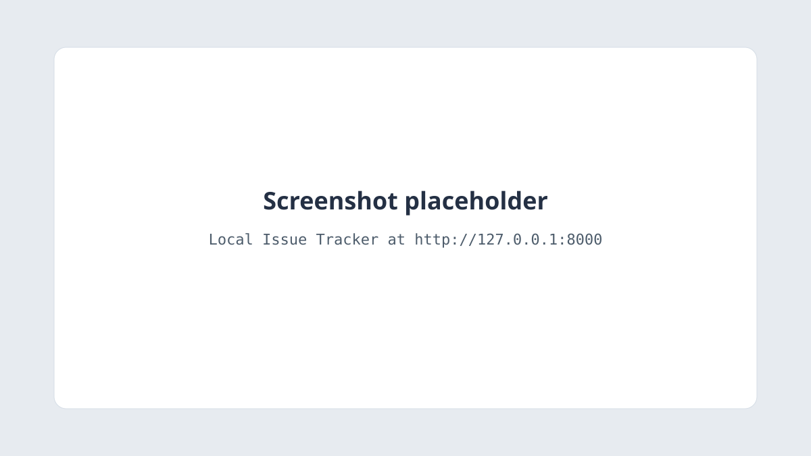

# Local Issue Tracker

A small issue tracker that runs only on your machine. It is the local API in the
demo “I Turned a Local API Into a Remote MCP Server.”

The browser shows the issues. The same process publishes an OpenAPI document.
[Fetch Hive MCP Gateway](https://github.com/Fetch-Hive/openapi-mcp) compiles that
document into MCP tools. A tunnel then lets a remote AI client call the API
while the API keeps listening on `127.0.0.1`.



## Requirements

- Python 3.12 or newer
- `make`
- Docker, only if you want to run the container
- [`mcp-gateway`](https://github.com/Fetch-Hive/openapi-mcp), only for the last section

The Docker image is `python:3.12-slim`. A newer local Python is fine for
`make dev` and `make test`.

## Quick start

```bash
make install
make dev
```

`make install` creates `.venv` and installs the app plus pytest.

`make dev` starts Uvicorn on `127.0.0.1` port `8000`. It does not bind
`0.0.0.0`. Open [http://127.0.0.1:8000](http://127.0.0.1:8000).

On startup the app creates `data/issues.db` when that file is missing. If the
`issues` table has no rows, it inserts three issues:

| Title | Priority | Status |
| --- | --- | --- |
| Add CSV export | medium | open |
| Review onboarding email copy | low | in_progress |
| Fix incorrect dashboard totals | high | resolved |

The list is ordered by `created_at` descending, then `id` descending, so the
newest issue is first. “Fix incorrect dashboard totals” is the newest of the
three. “Checkout fails when the session expires” is not seeded. That title is
created during the demo.

The page requests `GET /api/issues` every 2 seconds. When an id appears that
was not in the previous response, that row gets the class `is-new` for 2.8
seconds: an amber background and a “New” label. Reload does not insert the
seed rows again while the table still has rows.

`DATABASE_URL` overrides the SQLite URL. When it is unset, the app uses
`sqlite:///./data/issues.db`, relative to the working directory. No `.env`
file is required.

## Docker

```bash
docker compose up --build
```

Inside the container the process listens on `0.0.0.0:8000` so Docker can
forward the port. `compose.yaml` publishes that port as `127.0.0.1:8000` on
the host. Other machines still cannot connect.

Issue rows are stored in the `issue-data` volume at `/app/data/issues.db`.
`docker compose down -v` deletes the volume. The next start finds an empty
database and inserts the three seed issues again.

## API

Interactive docs: [http://127.0.0.1:8000/docs](http://127.0.0.1:8000/docs)

OpenAPI document: [http://127.0.0.1:8000/openapi.json](http://127.0.0.1:8000/openapi.json)

The document declares the server URL `http://127.0.0.1:8000`. Every request
and response field has a description. `PATCH` accepts a partial body: omitted
fields stay as they are, and `description: null` clears the notes.

| Method | Path | Operation ID | Success |
| --- | --- | --- | --- |
| `GET` | `/api/issues` | `list_issues` | `200` |
| `GET` | `/api/issues/{issue_id}` | `get_issue` | `200` |
| `POST` | `/api/issues` | `create_issue` | `201` |
| `PATCH` | `/api/issues/{issue_id}` | `update_issue` | `200` |
| `DELETE` | `/api/issues/{issue_id}` | `delete_issue` | `204` |

`404` means no issue has that id. The body is `{"detail": "No issue exists with this id."}`.
`422` means a field failed validation. `DELETE` success has an empty body.

`priority` is `low`, `medium`, or `high`. It defaults to `medium`.
`status` is `open`, `in_progress`, or `resolved`. It defaults to `open`.

### curl

```bash
curl http://127.0.0.1:8000/api/issues

curl http://127.0.0.1:8000/api/issues/1

curl -X POST http://127.0.0.1:8000/api/issues \
  -H 'Content-Type: application/json' \
  -d '{
    "title": "Checkout fails when the session expires",
    "description": "Leave checkout open for 30 minutes, then submit payment",
    "priority": "high",
    "status": "open"
  }'

curl -X PATCH http://127.0.0.1:8000/api/issues/1 \
  -H 'Content-Type: application/json' \
  -d '{"status": "resolved"}'

curl -X DELETE -i http://127.0.0.1:8000/api/issues/1
```

The create example is the issue used in the demo. With the page open, it
appears at the top of the table within two seconds.

## Tests

```bash
make test
```

Pytest uses a temporary SQLite file for each test. It does not read or write
`data/issues.db`.

## Reset

Stop `make dev` first. SQLite keeps the open file, so deleting it while the
server is running does not return the process to the seed data.

```bash
make reset
make dev
```

`make reset` deletes `data/issues.db` and nothing else. The next start creates
the file and, because the table is empty, inserts the three seed issues.

## Turn the local API into an MCP server

Install [`mcp-gateway`](https://github.com/Fetch-Hive/openapi-mcp) from that
repository. Leave `make dev` running, then:

```bash
mcp-gateway init --allow-private-networks

mcp-gateway add-spec \
  --name issues \
  --url http://127.0.0.1:8000/openapi.json \
  --insecure-http

export MCP_GATEWAY_TOKEN=YOUR_TOKEN

mcp-gateway inspect issues

mcp-gateway test issues list_issues --args '{}'

mcp-gateway serve issues --tunnel
```

`init` writes a config file and prints a bearer token once. The token is
`fh_mcp_live_` plus 48 hex characters (24 random bytes). It is not written
into the TOML. The file stores `token = { env = "MCP_GATEWAY_TOKEN" }`.
Replace `YOUR_TOKEN` with the printed value. Do not commit it.
`init` refuses to overwrite a config that already exists; pass `--force` only
when you mean to replace it.

`--allow-private-networks` sets `ssrf.allow_private_networks = true`. The
gateway then allows loopback, RFC1918, and IPv6 ULA. With loopback allowed,
port `8000` is allowed as well. The default policy is HTTPS on ports `80`,
`443`, and `8443`, and it refuses `127.0.0.1`.

`add-spec --insecure-http` fetches this OpenAPI document over HTTP. Without
that flag the fetch is refused. The spec’s server URL is
`http://127.0.0.1:8000`, so later tool calls use that origin. Compiled tool
names come from `operationId`. These ids are already snake_case, so the tools
are `list_issues`, `get_issue`, `create_issue`, `update_issue`, and
`delete_issue`. `inspect issues` prints them.

`test` calls `list_issues` on the local API and prints the upstream URL.

`serve issues --tunnel` keeps the issue tracker on `127.0.0.1:8000`. The
gateway process stays on loopback and opens an outbound WebSocket to the
Fetch Hive relay. It prints a public URL,
`https://<slug>.mcp.fetchhive.com/mcp`. The slug is eight characters from
`abcdefghjkmnpqrstuvwxyz23456789`. Remote clients must send
`Authorization: Bearer` with `MCP_GATEWAY_TOKEN`. A request with no bearer
token is `401`. The URL is released 30 minutes after the CLI exits. This
machine does not accept an inbound connection for the tracker.

Hosted gateway, tokens, and the dashboard: [https://www.fetchhive.com/mcp](https://www.fetchhive.com/mcp).

`mcp-gateway test` calls the upstream with insecure HTTP left off unless
`ssrf.allow_insecure_http` is true in the config `init` wrote. `serve` allows
HTTP when you pass `--allow-insecure-http`, or when that same config field is
true. `--insecure-http` on `add-spec` covers the spec fetch only. If a tool
call is refused with `scheme not allowed: http`, set
`allow_insecure_http = true` under `[ssrf]` in that config and run the
command again.

A remote client can then be told: “Create a high-priority issue called
‘Checkout fails when the session expires’. Add the reproduction note ‘Leave
checkout open for 30 minutes, then submit payment’, and set its status to
Open.” The client calls `create_issue`. Within two seconds the issue is the
first row on [http://127.0.0.1:8000](http://127.0.0.1:8000) and the row
highlights.

## Scope

This project is deliberately small. It is a development demonstration, not a
production deployment. The local API has no authentication because it binds to
loopback. Do not publish port `8000` on `0.0.0.0` or deploy the tracker as a
public service. The tunnel is the supported way to reach it from a remote
client, and that URL requires the bearer token.
